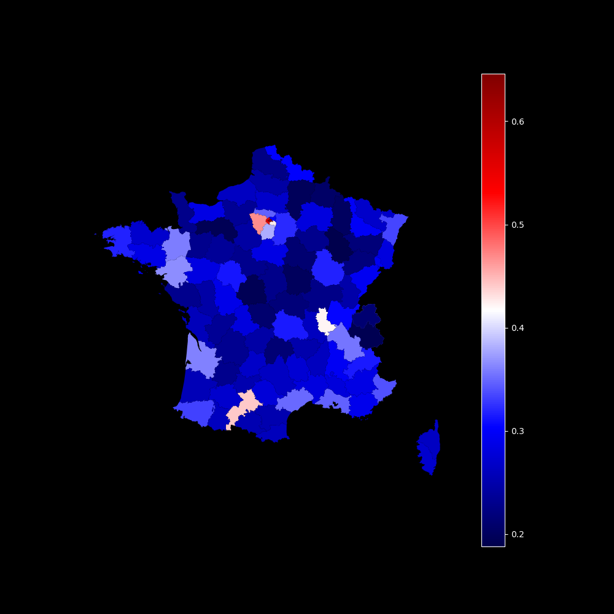

# Education supérieure en France

Ce repo regroupe quelques analyses sur la répartition de l'éducation supérieure en France. Ces analyses reposent sur les données de l'INSEE.

## Idées

- Etudier la répartition de diplomés de l'éducation supérieure par communes/départements/régions
- Étudier les différences d'accès à l'éducation supérieure entre les hommes et les femmes

## Données

Les données utilisées sont issues du recensement fait par l'[INSEE en 2020](https://www.insee.fr/fr/statistiques/1893149) prises au 06/01/2024.

## Graphiques

### Proportion des diplomés de l'enseignement supérieur par départements

